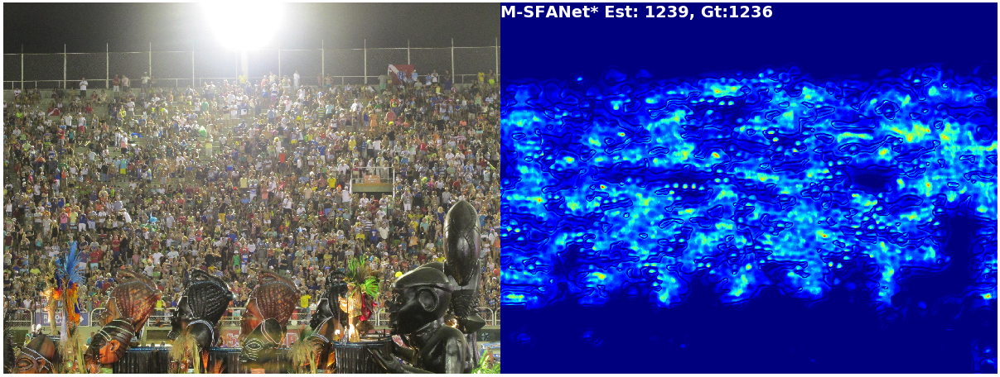
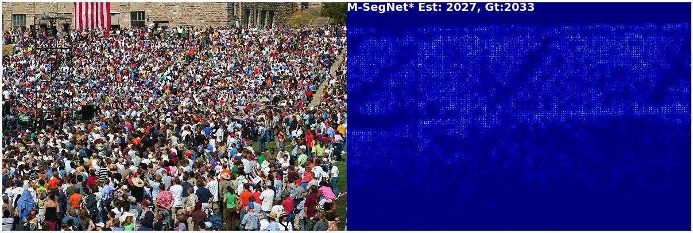

# Encoder-Decoder Based Convolutional Neural Networks with Multi-Scale-Aware Modules for Crowd Counting（ICPR 2020）
##  Official Implementation of "Encoder-Decoder Based Convolutional Neural Networks with Multi-Scale-Aware Modules for Crowd Counting" [LINK](https://arxiv.org/abs/2003.05586)
Many thanks to [BL](https://github.com/ZhihengCV/Bayesian-Crowd-Counting), [SFANet](https://github.com/pxq0312/SFANet-crowd-counting/) and [CAN](https://github.com/weizheliu/Context-Aware-Crowd-Counting) for their useful publications and repositories.

For complete UCF-QNRF and Shanghaitech training code, please refer to [BL](https://github.com/ZhihengCV/Bayesian-Crowd-Counting) and [SFANet](https://github.com/pxq0312/SFANet-crowd-counting/) respectively.

Please see ```models``` for our M-SFANet and M-SegNet implementations.

## Density maps Visualization




## Datasets (NEW)
To reproduce the results reported in the paper, you may use these preprocessed datasets. This is not completed yet, and might be updated in the future.

Shanghaitech B dataset that is preprocessed using the Gaussian kernel [Link](https://drive.google.com/file/d/1Jjmvp-BEa-_81rXgX1bvdqi5gzteRdJA/view?usp=sharing)

Bayesian preprocessed (following [BL](https://github.com/ZhihengCV/Bayesian-Crowd-Counting)) Shanghaitech datasets (A&B) [Link](https://drive.google.com/file/d/1azoaoRGxfXI7EkSXGm4RrX18sBnDxUtP/view?usp=sharing)

The Beijing-BRT dataset [Link](https://drive.google.com/file/d/1JRjdMWtWiLxocHensFfJzqLoJEFksjVy/view?usp=sharing) (Originally from [BRT](https://github.com/XMU-smartdsp/Beijing-BRT-dataset))

## Pretrained Weights
Shanghaitech A&B [Link](https://drive.google.com/file/d/1MxGZjapIv6O-hzxEeHY7c93723mhGKrG/view?usp=sharing)

To test the visualization code you should use the pretrained M_SegNet* on UCF_QNRF [Link](https://drive.google.com/file/d/1fGuH4o0hKbgdP1kaj9rbjX2HUL1IH0oo/view?usp=sharing) (The pretrained weights of M_SFANet* are also included.)

## Getting started
An example code of how to use the pretrained M-SFANet* on UCF-QNRF to count the number people in an image. The test image is ```./images/img_0071.jpg``` (from UCF-QNRF test set).

```python
import cv2
from PIL import Image
import numpy as np

import torch
from torchvision import transforms

from datasets.crowd import Crowd
from models import M_SFANet_UCF_QNRF

# Simple preprocessing.
trans = transforms.Compose([transforms.ToTensor(), 
                            transforms.Normalize([0.485, 0.456, 0.406], [0.229, 0.224, 0.225])
                           ])

# An example image with the label = 1236.
img = Image.open("./images/img_0071.jpg").convert('RGB')
height, width = img.size[1], img.size[0]
height = round(height / 16) * 16
width = round(width / 16) * 16
img = cv2.resize(np.array(img), (width,height), cv2.INTER_CUBIC)
img = trans(Image.fromarray(img))[None, :]

model = M_SFANet_UCF_QNRF.Model()
# Weights are stored in the Google drive link.
# The model are originally trained on a GPU but, we can also test it on a CPU.
model.load_state_dict(torch.load("./Paper's_weights_UCF_QNRF/best_M-SFANet*_UCF_QNRF.pth", 
                                 map_location = torch.device('cpu')))

# Evaluation mode
model.eval()
density_map = model(img)
# Est. count = 1168.37 (67.63 deviates from the ground truth)
print(torch.sum(density_map).item())
```

## Citation
If you find the code useful for your research, please cite our paper:
  
```
@inproceedings{thanasutives2021encoder,
  title={Encoder-Decoder Based Convolutional Neural Networks with Multi-Scale-Aware Modules for Crowd Counting},
  author={Thanasutives, Pongpisit and Fukui, Ken-ichi and Numao, Masayuki and Kijsirikul, Boonserm},
  booktitle={2020 25th International Conference on Pattern Recognition (ICPR)},
  pages={2382--2389},
  year={2021},
  organization={IEEE}
}
```